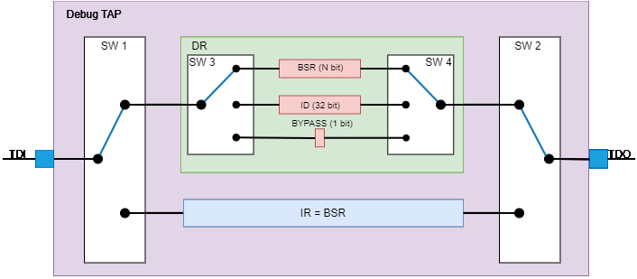
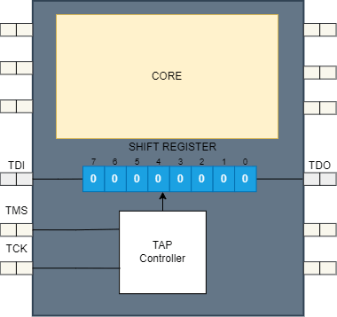
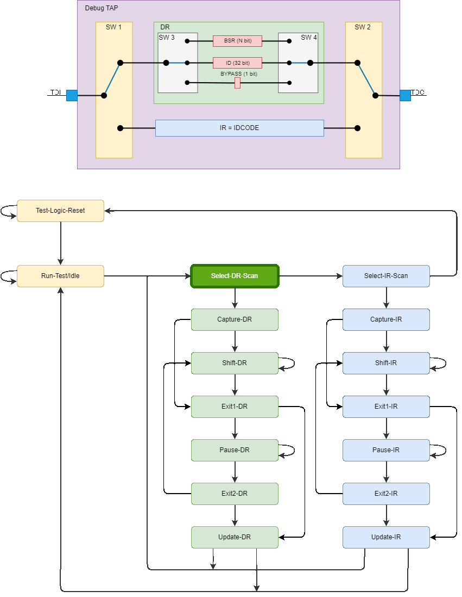
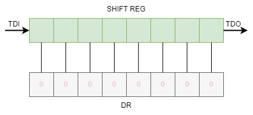
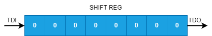
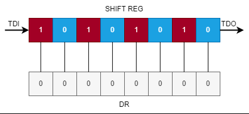

## Selection DR by Code in IR

## Shift Register

## Choose of Data or Instruction Path

## Parallel Data Load into Shift Register

## Shift data in Shift Register

## Parallel Data Load from Shift Register

## Example of ICODE Instruction Execution

