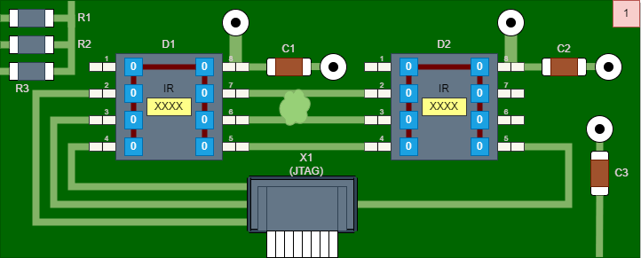

## JTAG `SAMPLE` instruction example

## JTAG `PRELOAD` instruction example

## JTAG `SAMPLE/PRELOAD` instruction example

## JTAG `EXTEST` instruction example

## JTAG `INTEST` instruction example

## Boundary scan test example

